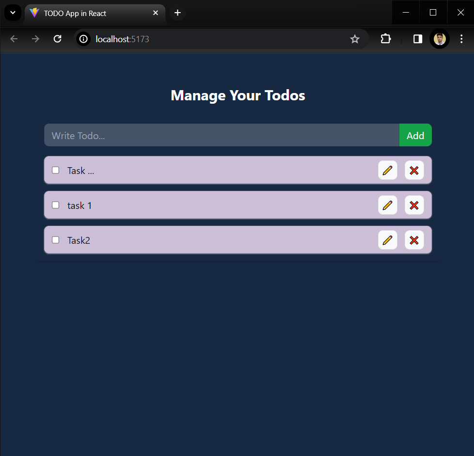

# TODO App in ReactJS using context API and Local Storage

Styled using Tailwind CSS
 
- React Context is a way to manage state globally.
  It can be used together with the useState Hook to share state between deeply nested components more easily than with useState alone.
  
- Use of local storage ensures that TODOs are saved even on reloading the page and on different tab.
   

## To use:
<code>cd .\TODO-App
  npm i
  npm run dev</code>

  ## Screenshot:
  
